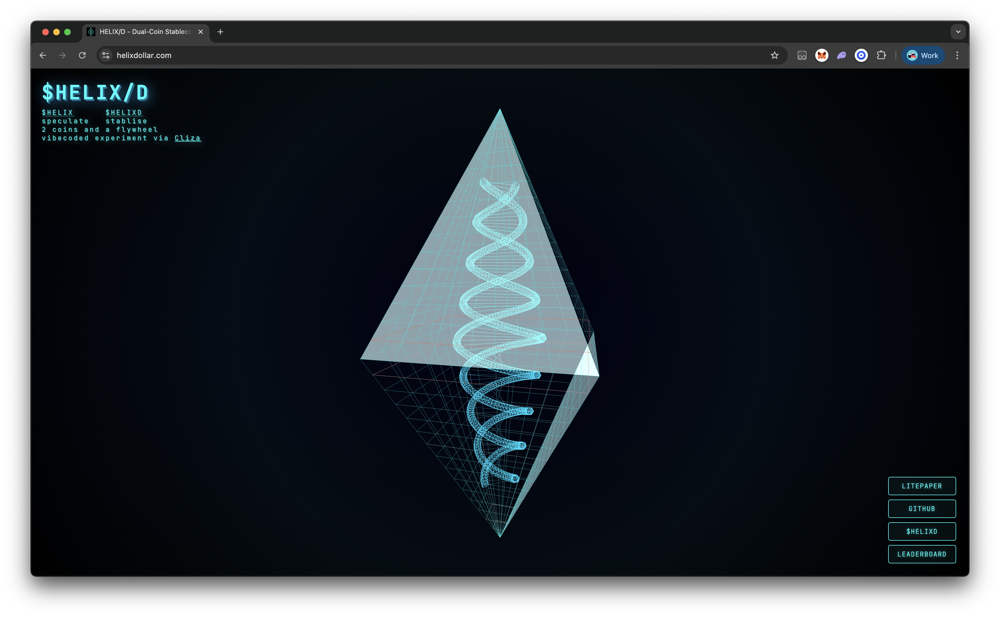

<div align="center">
  <a href="https://helixdollar.com" target="_blank">
    
  </a>
</div>

# HELIXD Stablecoin Contracts

Minimal smart contracts for deploying $HELIXD stablecoin on Base (or other EVM chains). This is the production pattern and it is used by Cliza's NFT Wars.

## About HELIXD

$HELIXD is a stablecoin designed to maintain a floor price of $1 (1:1 with USDC) while allowing unlimited upside. It uses Uniswap V3 single-sided liquidity (SSL).

📄 **[Read the Litepaper](https://docs.google.com/document/d/1hB4aJSoVFDMCEDZi4WL04EQlJnlJrCBzxJfdFwSIiWE/edit?usp=sharing)**

- **Floor Price**: $1 (pegged to USDC)
- **Upside**: Unlimited
- **Liquidity**: Single-sided Uniswap V3 position (HELIXD only)
- **Fee Collection**: LP fees accrue to the position NFT holder (deployer)

## Production Deployment

**$HELIXD on Base Mainnet:**

- **Contract Address**: `0x74dfe0470f823580ebC40c431177de964a7C248a`
- **Network**: Base (Chain ID: 8453)
- **Usage**: Powers Cliza's NFT Wars at [cliza.ai/nft](https://cliza.ai/nft) and potentially more in the future
- **Pair**: HELIXD/USDC on Uniswap V3 (0.3% fee tier)

## Architecture

### HelixDToken.sol

Simple ERC20 token:

- 6 decimal precision (matching USDC)
- Configurable initial supply
- All tokens minted to deployer
- Standard OpenZeppelin ERC20 implementation

### DeployHelixD.s.sol

One-transaction deployment script that:

1. Deploys the HELIXD token
2. Creates Uniswap V3 pool (HELIXD/USDC)
3. Initializes pool at 1:1 price
4. Adds single-sided liquidity (HELIXD only)
5. Performs micro swap to activate the position
6. LP NFT goes to deployer (who collects all fees)

## How It Works

The single-sided liquidity position is placed from tick `0` to tick `887,220`:

- **At $1 (tick 0)**: Position is 100% HELIXD tokens
- **Above $1**: As price rises, HELIXD converts to USDC, collecting fees
- **Below $1**: Price cannot fall below $1 (no liquidity below tick 0)

This creates a hard floor at $1 while allowing unlimited price appreciation.

## Prerequisites

- [Foundry](https://book.getfoundry.sh/getting-started/installation)
- Base RPC URL (or other target chain)
- Private key with sufficient funds:
  - ETH for gas (~$5-10)
  - USDC for initial swap (gets returned as USDC from the swap)

## Installation

```bash
# Clone the repository
git clone <your-repo-url>
cd helixd-contracts

# Install dependencies
forge install

# Build contracts
forge build
```

## Configuration

Edit `script/DeployHelixD.s.sol` to customize:

```solidity
// Supply (69 trillion with 6 decimals)
uint256 constant TOTAL_SUPPLY = 69_000_000_000_000 * 10 ** 6;

// Nudge swap amount (0.005 HELIXD)
uint256 constant NUDGE_SELL_HELIXD = 5_000;

// Pool fee tier (0.3%)
uint24 constant FEE = 3_000;
```

To change the token name/symbol, edit `src/HelixDToken.sol`:

```solidity
constructor(uint256 initialSupply) ERC20("Helix Dollar", "HELIXD") {
    _mint(msg.sender, initialSupply);
}
```

## Deployment

### 1. Set up environment variables

Create a `.env` file:

```bash
PRIVATE_KEY=your_private_key_here
BASE_RPC_URL=https://mainnet.base.org
BASESCAN_API_KEY=your_basescan_api_key_here
```

### 2. Deploy to Base Mainnet

```bash
# Load environment variables
source .env

# Deploy and verify
forge script script/DeployHelixD.s.sol:DeployHelixD \
    --rpc-url $BASE_RPC_URL \
    --private-key $PRIVATE_KEY \
    --broadcast \
    --verify \
    --etherscan-api-key $BASESCAN_API_KEY
```

### 3. Deploy to Base Sepolia (Testnet)

```bash
# Use testnet RPC
forge script script/DeployHelixD.s.sol:DeployHelixD \
    --rpc-url https://sepolia.base.org \
    --private-key $PRIVATE_KEY \
    --broadcast
```

**Note**: For testnet, update `USDC_BASE` address in the script to use testnet USDC.

## Post-Deployment

After deployment, you'll have:

- HELIXD token contract
- Active Uniswap V3 pool at ~$1 price
- LP NFT in your wallet (collect fees anytime)
- Ready for trading

### Collecting LP Fees

LP fees accrue to your position NFT. To collect:

1. Visit [Uniswap App](https://app.uniswap.org)
2. Connect wallet with your LP NFT
3. Go to "Pool" → Select your position
4. Click "Collect fees"

Or use the Position Manager contract directly:

```bash
cast send 0x03a520b32C04BF3bEEf7BEb72E919cf822Ed34f1 \
    "collect((uint256,address,uint128,uint128))" \
    "($TOKEN_ID,$YOUR_ADDRESS,340282366920938463463374607431768211455,340282366920938463463374607431768211455)" \
    --rpc-url $BASE_RPC_URL \
    --private-key $PRIVATE_KEY
```

### Managing Your Position

Your LP NFT can be:

- **Held**: Keep collecting fees indefinitely
- **Transferred**: Send to another wallet or contract
- **Burned**: Remove liquidity (use Uniswap interface)

## Important Addresses

### Base Mainnet

- **Uniswap V3 Factory**: `0x33128a8fC17869897dcE68Ed026d694621f6FDfD`
- **Position Manager (NFPM)**: `0x03a520b32C04BF3bEEf7BEb72E919cf822Ed34f1`
- **Swap Router**: `0x2626664c2603336E57B271c5C0b26F421741e481`
- **USDC**: `0x833589fCD6eDb6E08f4c7C32D4f71b54bdA02913`

## Why Single-Sided Liquidity?

Traditional liquidity pools require both tokens (50/50). SSL allows:

- Deploy with only HELIXD tokens (no USDC needed)
- Full control of price dynamics
- Hard price floor at $1
- Unlimited upside potential
- All fees collected by LP holder

## Security Considerations

- **Immutable**: Token contract has no admin functions or upgrades
- **Standard ERC20**: Uses battle-tested OpenZeppelin implementation
- **Transparent**: All code is open source and verifiable
- **Audited Libraries**: Built on Uniswap V3 and OpenZeppelin

## Testing

```bash
# Run tests (add your own test files)
forge test

# Run with gas reporting
forge test --gas-report

# Run with verbosity
forge test -vvv
```

## Customization

To deploy your own variant:

1. Fork this repository
2. Edit token name/symbol in `src/HelixDToken.sol`
3. Adjust supply in `script/DeployHelixD.s.sol` if needed
4. Deploy following the instructions above
5. Your token will have the same $1 floor + unlimited upside model

## Example Output

```
Deployer: 0x...
HELIXD deployed at: 0x...
Deployer HELIXD balance: 69000000000000000000
token0: 0x... (HELIXD)
token1: 0x... (USDC)
Pool created at: 0x...
slot0.sqrtPriceX96: 79228162514264337593543950336
slot0.currentTick: 0
LP NFT tokenId: 12345
Liquidity: 123456789...
amount0 used: 68999999995000
amount1 used: 0
Nudge swap out (USDC): 4999
Deployment complete
```

## Troubleshooting

### Pool already exists

If the pool already exists, the deployment will revert. You can:

- Use the existing pool
- Deploy with a different fee tier
- Use a different token address

### Insufficient USDC for swap

The nudge swap requires a tiny amount of USDC output. If it fails:

- Ensure you have some ETH for gas
- The swap sells HELIXD for USDC, so you don't need USDC upfront
- Check that the pool has initialized correctly

### Transaction fails

- Verify all addresses are correct for your network
- Ensure you have enough ETH for gas
- Check that your wallet has the HELIXD balance after minting

## License

MIT License - see contracts for details

## Support

For issues or questions:

- Open an issue on GitHub
- Review the [Foundry documentation](https://book.getfoundry.sh/)
- Check [Uniswap V3 documentation](https://docs.uniswap.org/)

## Acknowledgments

- Built with [Foundry](https://github.com/foundry-rs/foundry)
- Uses [OpenZeppelin Contracts](https://github.com/OpenZeppelin/openzeppelin-contracts)
- Powered by [Uniswap V3](https://uniswap.org/)
- Deployed by [Cliza](https://cliza.ai/)
